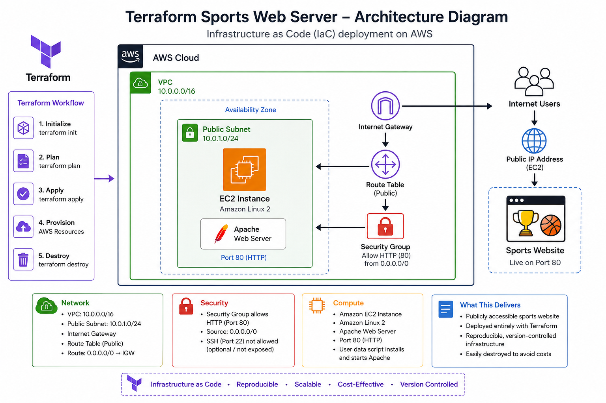

# Terraform Sports Web Server

## Project Overview

This project demonstrates how I used Terraform to automate the deployment of AWS infrastructure for a public sports web server.

Instead of manually creating cloud resources through the AWS Console, I defined the environment using Infrastructure as Code, making the deployment repeatable, consistent, and version-controlled.

## Business Scenario

A sports media organization needs a repeatable way to deploy temporary web servers for tournament coverage and special events.

Terraform was used to provision the complete AWS environment, deploy a web server, validate the application, and remove the infrastructure after testing to control cloud costs.

## Architecture

The Terraform configuration deployed:

- Custom Amazon VPC
- Public subnet
- Internet Gateway
- Public route table
- Route table association
- Security group allowing HTTP traffic
- Amazon EC2 instance
- Apache web server installed through EC2 user data

## Technologies Used

- Terraform
- Amazon Web Services
- Amazon EC2
- Amazon VPC
- AWS CLI
- Linux
- Apache HTTP Server
- Git
- GitHub

## Terraform Workflow

```bash
terraform init
terraform fmt
terraform validate
terraform plan
terraform apply
terraform destroy

## Architecture Diagram



This Terraform project provisions the complete AWS infrastructure for a public sports web server, including a custom VPC, public subnet, Internet Gateway, route table, security group, and Amazon EC2 instance running Apache.

---

## Project Results

✅ Successfully provisioned AWS infrastructure using Terraform

✅ Deployed an Apache web server on Amazon EC2

✅ Verified public website accessibility

✅ Destroyed infrastructure using `terraform destroy` to eliminate ongoing AWS costs

✅ Stored infrastructure as version-controlled code in GitHub
